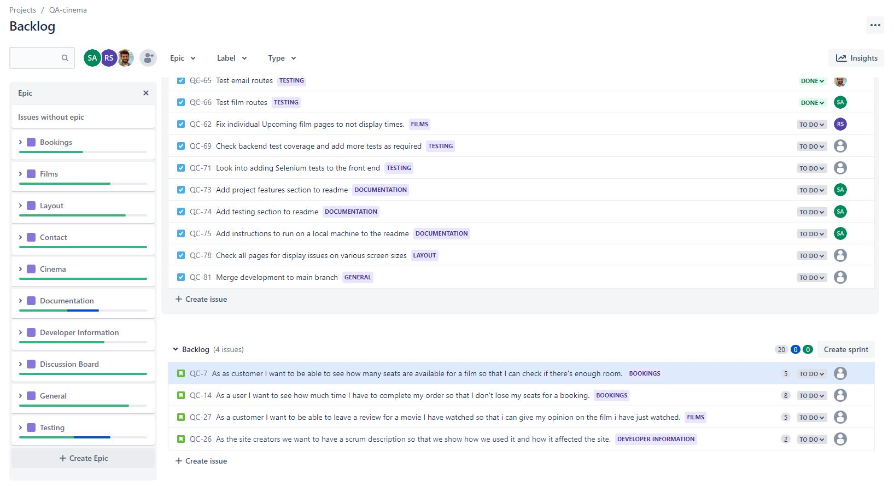
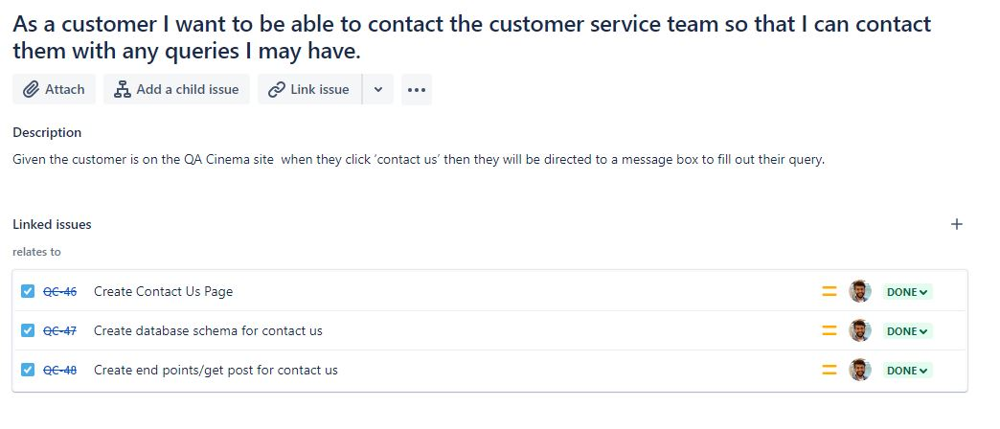
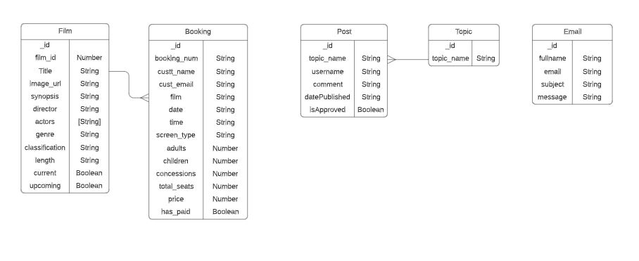

# QA Cinema

This project is a website for a cinema. It is a group project and was created using the MERN stack. A brief was provided for the pages that should be added to the site. These included film listing pages and pages providing information about the cinema. Functionality allowing for the booking of tickets, adding discussion posts and contacting the cinema was also requested.

## Planning

### Project Management

The project was planned and managed using Jira. The Jira project can be found [here](https://stephanie-ashdown.atlassian.net/jira/software/projects/QC/boards/4/backlog). The issues included in each sprint can be viewed under reports - sprint burndown chart. A number of user stories were created in the project backlog to describe the main functionality and these were grouped under epics. Acceptance criteria was added in the user story descriptions. The amount of work required for the user stories was estimated using story points and they were prioritised using MoSCoW.

For the more complicated user stories that required both frontend and backend functionality. A number of sub-tasks were created linked to the user story to track the work required to complete the story.

The work was was tracked in three sprints using a Kanban board and smart commits to manage the tracking and completion of the tasks. Stories and tasks were assigned to team members to carry out. Daily stand-up meetings were carried out to track the progress of the team members and deal with any concerns. Sprint retrospective meetings were held at the end of the sprints to discuss what went well and what could be approved in the next sprint.

A risk assessment was also created to prepare for any risks that may have adversely affected the project.

### Database Schema

An outline of the database schema was planned in advance and adapted as the project progressed. The MVP was kept in mind while creating the schema but also possible future expansion and fuctionaliy. A diagram of the final schema can be seen below.

