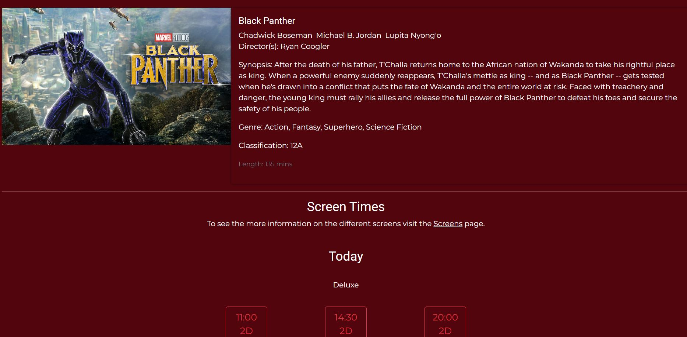
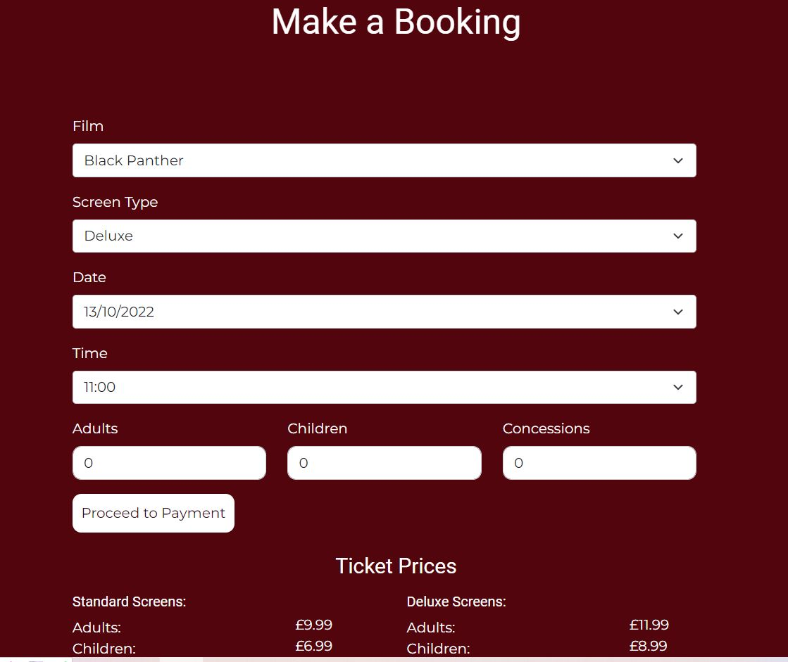
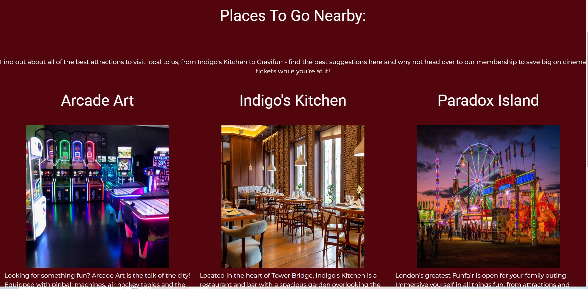
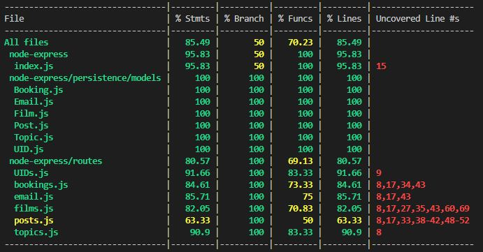

# QA Cinema

This project is a website for a cinema. It is a group project and was created using the MERN stack. A brief was provided for the pages that should be added to the site. These included film listing pages and pages providing information about the cinema. Functionality allowing for the booking of tickets, adding discussion posts and contacting the cinema was also requested.

## Planning and Management

### Project Management

The project was planned and managed using Jira. The Jira project can be found [here](https://stephanie-ashdown.atlassian.net/jira/software/projects/QC/boards/4/backlog). The issues included in each sprint can be viewed under reports - sprint burndown chart. A number of user stories were created in the project backlog to describe the main functionality and these were grouped under epics. Acceptance criteria was added in the user story descriptions. The amount of work required for the user stories was estimated using story points and they were prioritised using MoSCoW.


For the more complicated user stories that required both frontend and backend functionality. A number of sub-tasks were created linked to the user story to track the work required to complete the story.


The work was was tracked in three sprints using a Kanban board and smart commits to manage the tracking and completion of the tasks. Stories and tasks were assigned to team members to carry out. Daily stand-up meetings were carried out to track the progress of the team members and deal with any concerns. Sprint retrospective meetings were held at the end of the sprints to discuss what went well and what could be approved in the next sprint.

A risk assessment was also created to prepare for any risks that may have adversely affected the project. This and further screenshots for the kanban boards throughout the project can be found in the Additional Docs folder within documentation.

### Database Schema

An outline of the database schema was planned in advance and adapted as the project progressed. The MVP was kept in mind while creating the schema but also possible future expansion and fuctionaliy. A diagram of the schema can be seen below. A user id (UID) model was added after this diagram was created to provide additional functionality.


### Wireframes

During the planning stages, wireframes of some of the main pages were created to help plan the layout of the pages.


## Running the Project Locally

These instructions will detail how to get a copy of the project up and running on a local machine for development and testing purposes. It should be noted that these instructions are based on a Windows system.

### Requirements

#### Git

Git is a version control system to track changes to the project and push these changes to the repository. It can be downloaded and installed [here](https://git-scm.com/downloads).

**Installing Git**

* Download the installer and run it.
* Work through the setup pages selecting the most appropriate options, the below are some recommended selections.
* It is recommended that the default branch name is set as main.
* Select to use Git from Git Bash and the command line.

**Configuring Git**

* Open Git Bash then enter the following

```
git config --global user.name "username"
git config --global user.email "email@email.com"
```
* Using the same credentials as GitHub (see below) is recommended.

#### GitHub

GitHub can be used to manage the source control of the project. It is free to sign up for an account [here](https://github.com/).

**Forking the GitHub Repository**

* On GitHub navigate to the main page of the repository.
* The 'Fork' button can be found on the top right-hand side of the screen.
* Click the button to create a copy of the original repository.

**Cloning the Repository to a Local Machine**

* On GitHub navigate to the main page of the repository.
* Above the list of folders and files select Code and in the HTTPS section copy the URL.
* Open Git Bash.
* Using the cd command change the current working directory to the location required for the cloned directory.
* Type git clone and paste in the copied url and press Enter to create the local clone.

#### MongoDB

This project was created using MongoDB Atlas but could also be run using a local MongoDB server it can be downloaded and installed [here](https://www.mongodb.com/try/download/community).

**Installing MongoDB**

* Download the windows binary.
* Open Windows Explorer/File Explorer.
* Change the directory path to where you downloaded the MongoDB .msi file. By default, this is %HOMEPATH%\Downloads.
* Double-click the .msi file
* The Windows Installer guides you through the installation process.

**Setting Up the Database Connection**

* In the top level of the project node-express folder create a .env file.
* Within the file add the following variable MONGO_URL='your mongo localhost URI/qa-cinema'
* The local host URI can be found when launching MongoDB compass.
* The film records will need to be saved into the database in order for the project to display correctly when launched. These can be found in the persistence/data folder within the node-express folder.

#### Node

This project was created using Node. It can be downloaded and installed [here](https://nodejs.org/en/download/).

### Opening and Running the Project

These instructions will detail how to open and run the project.

#### Opening the Project

* Once cloned locally the project can be opened in an IDE. Visual Studio Code is recommended and can be downloaded and installed here [here](https://code.visualstudio.com/).
* Open the project folder within VSCode.
* Open a terminal and navigate to the node-express folder using cd node-express.
* Run npm i in the terminal to install the project dependencies.
* Navigate to the react/qa-cinema folder and run npm i to install all the react dependencies.
* The react project uses Stripe for the payments system. A stripe account is required for this.
* To use Stripe create a .env file in the top level of the react/qa-cinema folder and add the following variable REACT_APP_STRIPE_PK='add your stripe public key here'.

#### Running the Project

* Both the express app server and the react app server need to be running in order to run the project.
* Open two terminals and navigate to the node-express folder in one and the react/qa-cinema folder in another. Run npm start in both terminals.

## Project Features

Below are some screenshots of some of the front-end pages of the project.

Film pages



Bookings



Places to Go Page



## Testing

### Api Testing

Tests have been written for the various backend api http routes. They can be found within the tests folder in the node-express app. The current testing coverage for the routes is 80.57%. To run the tests open a terminal in the node-express folder and run npm test in the terminal. To create the coverage report run npm run coverage.



#### Front End Testing

All the functionality on the front end has been manually tested.

* The links on all pages have been tested to check they are linking to the correct pages.
* The booking system has been tested to make sure it successfully creates a booking.
* The email form has been tested to make sure it creates an email in the database.
* The discussions page has been tested to make sure it creates posts and correctly filters the displayed discussion posts.
* The admin login and discussion post approval system has been tested to ensure functionality.

## Built With

* [JavaScript](https://www.javascript.com/) - Backend programming language
* [Node](https://nodejs.org/en/) - Backend Development
* [Express](https://expressjs.com/) - API Develpment Platform

## Versioning

* [Git](https://git-scm.com/) has been used as a version control system.

## Authors

* **Stephanie Ashdown** - [stephanie-ash](https://github.com/Stephanie-Ash)
* **Rebecca Swinton** - [rebeccaswinton](https://github.com/rebeccaswinton)
* **Kishan Kunvardia** - [kishankunvardia](https://github.com/kishankunvardia)
* **Leonid Gornovskiy** - [lng1996](https://github.com/lng1996)

## License

This project is licensed under the MIT license - see the [LICENSE.md](LICENSE.md) file for details 

*For help in [Choosing a license](https://choosealicense.com/)*
